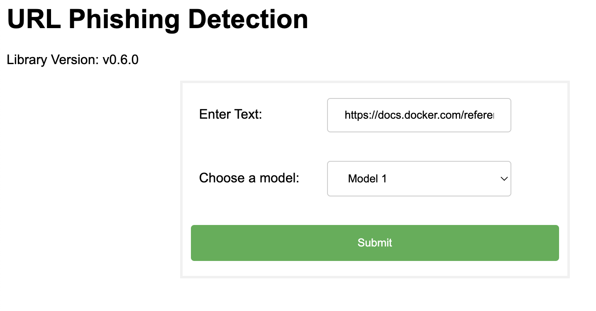

# Operation: URL Phishing (REMLA Team 14)
Central repository that contains all information about running the URL Phishing application and operating the cluster.

Later, this repository will also contain information about provisioning and deployment (Vagrant, Ansible, Docker Compose, Kubernetes etc.).
For now, this repository merely contains a `docker-compose` file, serving as the most simple way to deploy the application for a showcase.


- Our `app` and `model-service` are released as two separate container images (can be deployed separately from each other)
- Our ML model is released as well (see `release.yml` in our `model-training` repository), which can be exchangeable

## High-level Architecture

- TODO: Introduce architecture
- TODO: Add links to repos

This project is powered by several components which have their dedicated repositories.

### App-frontend and -service


### Lib-version


### Model-service


### Lib-ml


For further details about the respective repositories, please navigate to their specific project READMEs.

## Installations


## How to: Start the Application

- Parameters, vars, requirements



Upon running `docker ps`, you will see the following two containers being active:

```
CONTAINER ID   IMAGE                     COMMAND           CREATED          STATUS          PORTS                    NAMES
a7988dbfb1c6   operation-app             "python app.py"   35 seconds ago   Up 34 seconds   0.0.0.0:3000->8000/tcp   operation-app-1
ea97335d9dfd   operation-model-service   "flask run"       36 seconds ago   Up 34 seconds   0.0.0.0:5001->5000/tcp   operation-model-service-1
```
