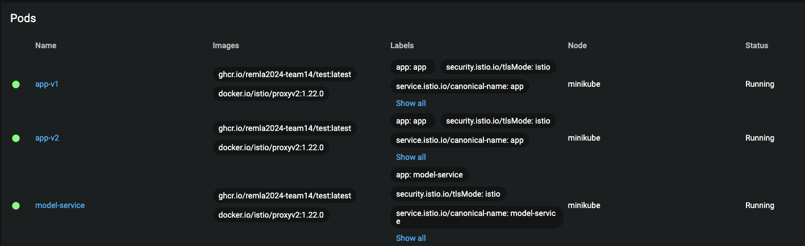

# Operation: URL Phishing (REMLA Team 14)

Central repository that contains all information about running the URL Phishing application and operating the cluster.

Later, this repository will also contain information about provisioning and deployment (Vagrant, Ansible, Docker Compose, Kubernetes etc.).
For now, this repository merely contains a `docker-compose` file, serving as the most simple way to deploy the application for a showcase.

## High-level Architecture

This project contains several independent components which have their dedicated repositories - see the reference architecture below.

Our `app` and `model-service` are released as two separate container images (can be deployed separately from each other).


_Source: REMLA 2023/2024 Assignment 2_

### Model-service

_Repository link: https://github.com/remla2024-team14/model-service_

- Represents a wrapper service for the released ML model
- Offers a REST API to expose the trained model to other components and make it scalable
- Our ML model is released as well, which can be exchangeable
- Depends on `lib-ml` through PyPi
- Automatic release to GitHub's container registry, with automatic versioning

### Model-training

_Repository link: https://github.com/remla2024-team14/model-training_

- Contains the ML training pipeline for our URL Phising detection application
- All pre-processing logic is powered by our custom library `lib-ml`

### Lib-ml

_Repository link: https://github.com/remla2024-team14/lib-ml_

- Contains the pre-processing logic for data used for ML training and querying incl. tokenization
- Versioned automatically
- Automatically released in PyPi package registry

### Lib-version

_Repository link: https://github.com/remla2024-team14/lib-version_

- A version-aware library that can be asked for the version of the library (see the class `VersionUtil`)
- The library is released automatically to PyPi

### App-frontend and -service

_Repository link: https://github.com/remla2024-team14/app_

- Queries the `model-service` through REST requests, allowing for users to enter URL input for phishing detection
- Depends on the `lib-version` through PyPi, allowing for displaying its version on the main web page
- The URL of the `model-service` is configurable as an environment variable

For further details about the respective repositories, please navigate to their specific project READMEs.

## Getting Started

1. Ensure you have Docker installed: refer to https://docs.docker.com/compose/install/.
2. Clone this central repository.

```
git clone https://github.com/remla2024-team14/operation.git
```

3. Inside this project, clone the following two projects it serves.

```
git clone https://github.com/remla2024-team14/model-service.git
git clone https://github.com/remla2024-team14/app.git
```

This is what your project will look like roughly:

```
operation
│   README.md
│   docker-compose.yml   
|   urlfishing-deployment.yml
|   urlfishing_chart
│
└──- app
│   │   app.py
│   │   Dockerfile
|   |    ...
│   │
│   └───templates
│       │   ...
│   
└─── model-service
    │   app.py
    │   Dockerfile
    |     ...
```

## How to: Start the Application using Docker Compose

From your project's root, simply run the commands below. This is the power of Docker Compose!

```
docker-compose build     # In case the Dockerfiles have been modified, rebuild images
docker-compose up -d
```

Here, `-d` instructs Docker to start the container as a background daemon.

Upon running `docker ps`, you will see the following two containers being active:

```
CONTAINER ID   IMAGE                     COMMAND           CREATED          STATUS          PORTS                    NAMES
a7988dbfb1c6   operation-app             "python app.py"   35 seconds ago   Up 34 seconds   0.0.0.0:3000->8000/tcp   operation-app-1
ea97335d9dfd   operation-model-service   "flask run"       36 seconds ago   Up 34 seconds   0.0.0.0:5001->5000/tcp   operation-model-service-1
```

Now when you navigate to your localhost (e.g. `http://localhost:3000/`) that serves the `app`, you see the UI of our URL Phishing Detection application:


In the form above, users can enter a URL to check, as well as select a model of choice.

To stop the application, use `docker-compose down`.

## How to: Start the Application using Kubernetes

Firstly, run `eval $(minikube docker-env)` in your terminal to use the Minikube docker-env for the current session.

Now, build the *operation-app* and *operation-model-service* images inside this environment in order to allow for the local images to be pulled by Kubernetes. This is similar to what we did above:

```
docker-compose build
```

Next, use Kubectl to apply our deployment YAML file defining our Deployments, Services and Ingress.

```
kubectl apply -f k8s-deployment.yml
```

In your Minikube dashboard (`minikube dashboard`), the following Deployments and Pods should be visible:


Note that you can also retrieve these from your terminal:

Running `kubectl get pods` should give:

```
NAME                                 READY   STATUS    RESTARTS   AGE
fishing-model-depl-9d6fccb69-74shc   1/1     Running   0          6m52s
fishing-model-depl-9d6fccb69-h8wr2   1/1     Running   0          6m52s
fishing-model-depl-9d6fccb69-pb6qv   1/1     Running   0          6m52s
fishing-web-depl-7f46d45845-krdqj    1/1     Running   0          6m52s
```

The number of replicas depends on the configs.

Similarly, `kubectl get services` outputs:

```
NAME                 TYPE        CLUSTER-IP     EXTERNAL-IP   PORT(S)    AGE
fishing-model-serv   ClusterIP   10.101.39.45   <none>        4000/TCP   7m14s
fishing-web-serv     ClusterIP   10.99.48.123   <none>        3000/TCP   7m14s
kubernetes           ClusterIP   10.96.0.1      <none>        443/TCP    6d23h
```

To delete all resources from the cluster, run the following:

```
kubectl delete -f k8s-deployment.yml
```

## How to: Install Helm Charts to K8s Cluster

Similarly to applying our deployment YAML file in the section above, we can install pre-defined Helm templates that come with flexibility (config values defined in `values.yaml`) and reusability.

Prerequisites:

- Firstly, ensure you have Helm installed using `helm version`
- Make sure Minikube is running (`minikube start --driver=docker`)
- Optionally: open Minikube's dashboard (`minikube dashboard`)

Now, we can install our Helm charts to any K8s cluster, on your host or VM.
Note we have separate deployment templates for our model and app, both under *urlfishing_chart*.

From the *operation* repository's root, run:

```
helm install <YOUR_RELEASE_NAME> ./urlfishing_chart/
```

Optionally, you can add the `--dry-run` parameter, which will not directly apply anything to the cluster.

This should output something like:

```
NAME: <YOUR_RELEASE_NAME>
LAST DEPLOYED: Tue May 21 13:59:27 2024
NAMESPACE: default
STATUS: deployed
REVISION: 1
TEST SUITE: None
```

All defined Pods and Services should be visible in your Minikube dashboard or terminal, as shown in section above.

To clean up your resources, run:

```
helm uninstall <YOUR_RELEASE_NAME>
```


## How to: Istio Deployment

In order to get authorized for pulling Docker images from GHCR, configure a personal GHCR Login Secret by running: 
```
kubectl create secret docker-registry ghcr-login-secret --docker-server=https://ghcr.io --docker-username=YOUR_GITHUB_USERNAME --docker-password=YOUR_PAT --docker-email=YOUR_GITHUB_EMAIL 
```

Similarly to a regular Kubernetes deployment, you can now run `kubectl apply -f istio-deployment.yml` from the `kubernetes` directory.

Again, you can use `kubectl get pods` to check whether everything was succesful.
When you open the web app in `localhost:3000` and refresh, you will see that 90% of the time, you will be redirected to `app/v1`.




## How to: Setting up Virtual Infrastructure with Vagrant

Make sure you have Vagrant and VirtualBox/VMWare installed.
Navigate to the Vagrantfile for ARM or x86 (normal) and run `vagrant up` in terminal. It will create 1 controller node and 2 worker nodes.
IP has been made static for more convenient later use with Kubernetes.

### Vagrant Config

`CONTROLLER_IP = "192.168.50.10"`

`X = {11, 12}`

`NETWORK_PREFIX = "192.168.50.X"`

Furthermore, the names are *"controller"*, *"node1"* and *"node2"*. 

You can run them by using `vagrant ssh <NAME>` from the directory that contains the Vagrantfile.

To test the communication between VMs (without port-forward), the following steps can be taken:
- Run all VMs (in different terminals)
- Check the IPs of the VMs using `ip address`
- Ping every other VM from one of the other VMs using `ping <IP_ADDRESS>` 

The result from *node1* to *node2* should roughly look like this: 

.


## How to: Setting up Software Environment with Ansible

This following steps provide a detailed guide to set up a multi-node Kubernetes cluster using Ansible and k3d, including the installation of Kubernetes Dashboard, Prometheus, and Grafana.

### Prerequisites
- Ansible installed on your local machine
- k3d installed on your local machine
- Vagrant installed and configured with the necessary VMs

### Running Ansible playbooks

Ensure that the **inventory.ini** file contains your own **ansible_host** , **ansible_ssh_user** and **ansible_ssh_password** of the control and worker nodes before running the playbooks.

*NOTE：If you're not sure what your ansible_host, ansible_ssh_user and ansible_ssh_password are, you can run them using the examples we've given you in inventory.ini and find your own relevant information by following the error prompts.*

From the root directory of your project, run:

```bash
ansible-playbook -i inventory.ini setup_kubernetes_x86.yml
ansible-playbook -i inventory.ini setup_monitoring.yml
```

### Configuring Kubectl Locally

Copy the kubeconfig file for the control node locally, and then set the environment variables so that the localhost can access the Kubernetes cluster: `scp user@controller:/home/<user>/.kube/config ~/.kube/config`.

- The user here is the username on the control node
- Execute the following command on the control node to find the location of the kubeconfig file to modify " /home/\<user>/.kube/config ": `sudo find / -name config`


In order for Kubectl to find and use this kubeconfig file, you need to set the environment variable KUBECONFIG to point to this file: `export KUBECONFIG=~/.kube/config`.

You can verify that Kubectl is accessing the Kubernetes cluster correctly with the following command: `kubectl cluster-info`.

### Testing Connectivity to the Cluster

Further testing to see the status of all nodes: `kubectl get nodes`
If configured correctly, you should see a list of all nodes and their status.


### Accessing Grafana and Prometheus via VM

List the services to find the NodePort values: `kubectl get svc -n monitoring`.

- Grafana: `http://<node-ip>:<grafana-nodeport>`
- Prometheus: `http://<node-ip>:<prometheus-nodeport>`


Replace `<node-ip>` with the IP address of one of your worker nodes and `<grafana-nodeport>` and `<prometheus-nodeport>` with the respective NodePort values from the output of the `kubectl get svc` command.
You can run the following command to get the IP addresses of all the nodes:

```bash
kubectl get nodes -o wide
```

You can use curl to check if the services are accessible:

```bash
curl http://<node-ip>:<grafana-nodeport>
curl http://<node-ip>:<prometheus-nodeport>
```


### Accessing Prometheus and Grafana Locally

To run Prometheus locally without Helm, you need to make sure Prometheus is installed, then run `prometheus.exe --config.file=prometheus.yml`.

To run Grafana locally, just download it and it will continually run on your localhost on port 3000 (use a browser to go to 127.0.0.1:3000).
Then configure a data source to the port Prometheus is running (by default, localhost:9093) and importing the dashboard JSON located in the path *grafana-dashboards/dashbard.json*.

